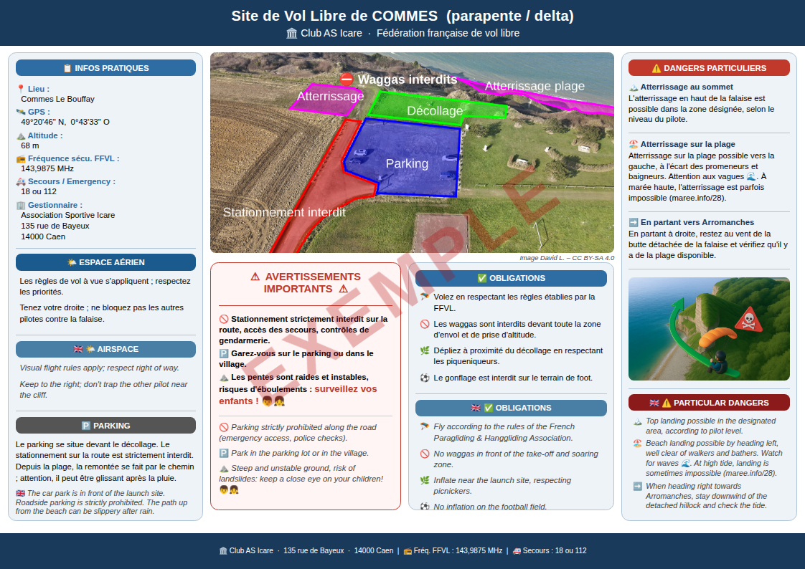

# Panneau Site de Vol Libre de COMMES

Panneau d'information A4 paysage pour le site de parapente/delta de Commes (Calvados), géré par le Club AS Icare.

📄 **[Télécharger le PDF](https://raw.githubusercontent.com/Davidlouiz/panneau_commes/main/panneau_commes.pdf)**



---

## Contenu du dépôt

| Fichier | Description |
|---|---|
| `panneau_commes.html` | Le panneau complet (HTML + CSS auto-contenu) |
| `export_pdf.sh` | Script d'export en PDF via Playwright (Chromium) |
| `panneau_commes_v1.jpg` | Photo aérienne du site (col. centrale) |
| `fc25943c-...jpg` | Photo parapentiste (colonne droite) |
| `screenshot.py` | Script utilitaire pour régénérer l'aperçu PNG |

---

## Modifier le panneau

Ouvrir `panneau_commes.html` dans un éditeur de texte ou VS Code. Le fichier est autonome (HTML + CSS dans un seul fichier).

### Structure des colonnes

```
┌──────────────┬─────────────────────────────────────────┬──────────────┐
│  Col A       │  Photo aérienne (col-bc)                │  Col D       │
│  72mm        ├──────────────────────┬──────────────────┤  65mm        │
│  Infos       │  ⚠ Avertissements   │  ✅ Obligations  │  Dangers     │
│  Espace aér. │                      │                  │  Photo       │
│  Parking     │                      │                  │  EN list     │
└──────────────┴──────────────────────┴──────────────────┴──────────────┘
```

### Modifier les textes

- **Infos pratiques (GPS, altitude, fréquence…)** : rechercher les balises `<div class="info-label">` et `<div class="info-value">` dans la section `<!-- COL A -->`
- **Avertissements** : balises `<div class="warn-item">` et `<div class="warn-en">` dans `<div class="warn-box">`
- **Obligations** : listes `<ul class="bullets">` dans `<div class="col-bc-right">`
- **Dangers particuliers** : balises `<div class="danger-title">` et `<div class="danger-body">` dans `<!-- COL D -->`
- **Parking** : balises `<div class="parking-note">` en bas de la colonne A

### Modifier les couleurs

Les couleurs sont définies dans les variables CSS en haut du fichier :

```css
:root {
  --dark-blue: #1A3A5C;   /* header, footer */
  --mid-blue:  #2E6DA4;   /* titres de section */
  --accent-red: #C0392B;  /* avertissements */
  ...
}
```

### Remplacer les photos

- **Photo aérienne** : remplacer `panneau_commes_v1.jpg` par une image de même nom (ou modifier le `url()` dans la classe `.photo-aerial`)
- **Photo parapentiste** : remplacer l'attribut `src` de la balise `` dans la colonne D

---

## Exporter en PDF

### Prérequis (première fois)

```bash
# Créer un environnement Python
python3 -m venv .venv
.venv/bin/pip install playwright pillow
.venv/bin/playwright install chromium
```

### Générer le PDF

```bash
bash export_pdf.sh
```

Le PDF `panneau_commes.pdf` est généré dans le dossier. Format A4 paysage, rendu identique au navigateur.

### Régénérer l'aperçu PNG

```bash
.venv/bin/python screenshot.py
```

---

## Licence

Photo aérienne : David L. – CC BY-SA 4.0
